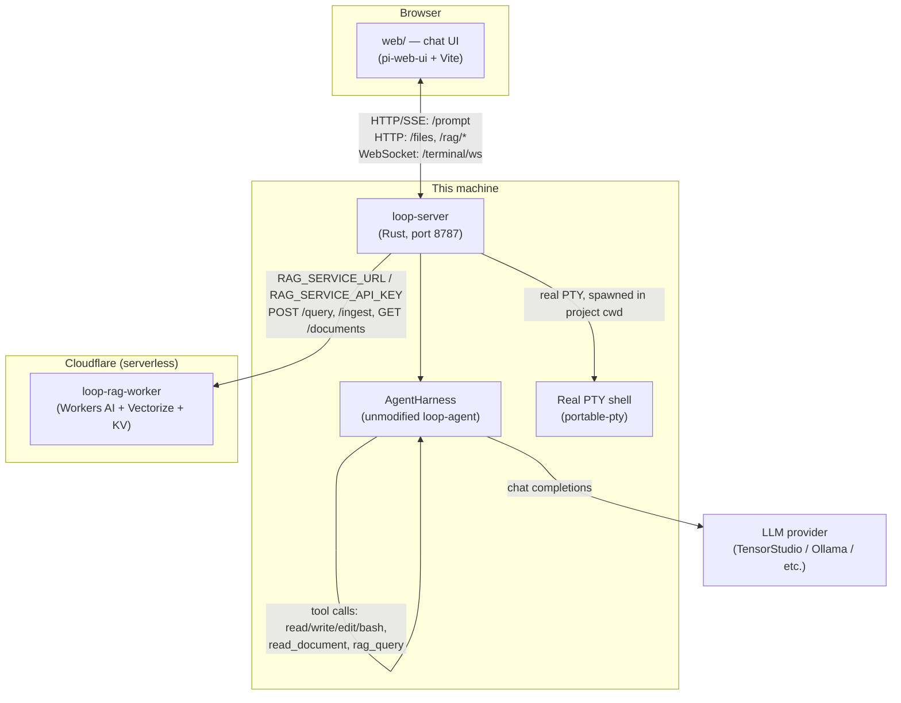

# The Loop Bridge

A browser-based chat UI for [Loop](README.md)'s `AgentHarness` — the same
stateful agent the `loop` TUI uses, exposed instead over HTTP/SSE/WebSocket
to a real web frontend. Built on top of Loop without modifying it: every
file under `crates/loop-agent`, `crates/loop-ai`, and `crates/loop-cli` is
untouched. Everything described here lives in three new, separate pieces —
`crates/loop-server/`, `web/`, and `cloudflare-rag/` — that consume Loop's
existing public API from the outside.

This document is the system-level overview. Each piece also has its own
much more detailed README, including the specific bugs hit and fixed along
the way, live-verification notes, and code-level rationale:

- [`crates/loop-server/README.md`](crates/loop-server/README.md) — the bridge server itself
- [`web/README.md`](web/README.md) — the chat frontend
- [`cloudflare-rag/README.md`](cloudflare-rag/README.md) — the RAG service

## What this actually is

Three cooperating pieces, each independently replaceable:

1. **`loop-server`** (Rust) — boots a real `AgentHarness` the same way the
   TUI does, then translates its internal event stream into JSON pushed to
   a browser. No thinking of its own; a pure protocol bridge.
2. **`web/`** (TypeScript, Vite, `pi-web-ui`) — the actual chat interface a
   person uses. Talks to `loop-server` over HTTP/SSE, and to nothing else
   directly.
3. **`cloudflare-rag/`** (TypeScript, Cloudflare Workers) — a small,
   real RAG (retrieval-augmented generation) service, standing in until a
   production RAG system exists. Runs entirely on Cloudflare's edge — zero
   compute on whatever machine runs `loop-server`.

## Architecture



Two independent network hops leave your machine: `loop-server` → the LLM
provider (for chat), and `loop-server` → the Cloudflare Worker (for RAG).
Everything else — the terminal, file browsing, the harness itself — runs
locally.

## Features

### Chat
Real-time streaming responses over Server-Sent Events, backed by the real
`AgentHarness` — not a mock, not a scripted demo. Session state persists
server-side across restarts (`.loop-server-session-id`).

### Files
Browses the filesystem the `loop-server` process can read (by explicit
request, scoped to the whole filesystem — see "Security" below, not just
the project directory).

### Terminal
A real, interactive PTY-backed shell (`portable-pty`), streamed over a raw
WebSocket. The same level of access the model's own `bash` tool already
has — a human typing directly, not a new capability.

### Tool calling
The model has 6 real tools it can invoke on its own:

| Tool | What it does |
|---|---|
| `read`, `write`, `edit`, `bash` | Loop's standard 4 (unmodified, from `loop_cli::runtime::build_tools`) |
| `read_document` | Reads a PDF or text file already on disk, real extraction via `pdf-extract` |
| `rag_query` | Queries the configured RAG service for context |

### RAG — two ways to use it
1. **Automatic**: the model calls `rag_query`/`read_document` on its own
   whenever it decides a question needs them.
2. **Manual, instant, no LLM turn**: four slash commands, typed directly or
   picked from the `+` button's dropdown menu:

   | Command | Does |
   |---|---|
   | `/rag-query <question>` | Semantic search + generated answer |
   | `/rag-add <path>` | Ingests a file from disk into the RAG service |
   | `/rag-list` | Lists every ingested document |
   | `/rag-get <doc_id>` | Fetches one document's **exact** original text (not a search result) |

   Results from these four render visually distinct from normal chat
   replies — a purple accent border, tinted background, and an uppercase
   label (e.g. `RAG-QUERY`) — so it's obvious at a glance that an answer
   came from a direct tool call, not the model's own words.

## Getting started

```bash
# 1. Build the bridge
cargo build -p loop-server

# 2. Configure it (copy and edit)
cp .env.example .env
# at minimum: point LOOP_SERVER_PROVIDER/LOOP_SERVER_MODEL at something
# real (a hosted API, or a local Ollama — see .env.example for both), and
# optionally RAG_SERVICE_URL/RAG_SERVICE_API_KEY for RAG

# 3. Run it
./target/debug/loop-server
# → registers 6 tools, boots the harness, listens on :8787

# 4. Run the frontend, separately
cd web && npm install && npm run dev
# → opens on :5173
```

Or both together: `./scripts/dev.sh` from the repo root.

## Configuration

All of it lives in `.env` at the repo root (see `.env.example` for the full
annotated reference). The pieces most relevant to this bridge:

```bash
# Which model the harness talks to
LOOP_SERVER_PROVIDER=tensorstudio-litellm   # or "ollama" for a free local model
LOOP_SERVER_MODEL=qwen3-8-27b

# RAG service (see "The RAG system" below)
RAG_SERVICE_URL=https://loop-rag-worker.<your-subdomain>.workers.dev
RAG_SERVICE_API_KEY=<your-key>

# Networking
LOOP_SERVER_PORT=8787
LOOP_SERVER_CORS_ORIGIN=http://localhost:5173
```

## API reference

| Method | Path | Purpose |
|---|---|---|
| `GET` | `/health` | `{session_id, status}` |
| `POST` | `/prompt` | `{text}` → SSE stream of chat events |
| `GET` | `/files` | Directory listing |
| `GET` | `/files/content` | File contents (text preview) |
| `GET` | `/terminal/ws` | WebSocket upgrade → real PTY shell |
| `POST` | `/rag/query` | Direct RAG query, no LLM turn (`/rag-query`) |
| `POST` | `/rag/ingest` | Direct RAG ingest, no LLM turn (`/rag-add`) |
| `GET` | `/rag/documents` | List ingested documents (`/rag-list`) |
| `GET` | `/rag/documents/:id` | Exact document text (`/rag-get`) |

Full request/response shapes, status codes, and the reasoning behind each
are in [`crates/loop-server/README.md`](crates/loop-server/README.md#api).

## The RAG system

**What it is right now**: a from-scratch RAG service
([`cloudflare-rag/`](cloudflare-rag/README.md)) — real embeddings
(`@cf/baai/bge-base-en-v1.5`), a real vector database (Cloudflare
Vectorize), and real generation (`@cf/meta/llama-3.1-8b-instruct-fast`),
all running on Cloudflare Workers. Retrieval, augmentation, and generation
are all genuinely happening — it's a real RAG architecture, just a minimal
custom implementation rather than a named product. Built specifically to
require zero local or server compute, after an earlier local-Docker
attempt (self-hosted R2R) crashed the machine it ran on.

**It's a placeholder, not the destination.** The whole point of the design
below is that a real, production RAG system can be swapped in later with
minimal — ideally zero — code changes here.

### The interface contract

`loop-server` only knows about one small, fixed shape — nothing
Cloudflare-specific is hardcoded anywhere in this repo's Rust or
TypeScript:

| | Request | Response |
|---|---|---|
| `POST {RAG_SERVICE_URL}/query` | `{"query": "..."}` | any JSON (`{"answer", "matches"}` renders nicest) |
| `POST {RAG_SERVICE_URL}/ingest` | `{"text": "...", "id": "..."}` | any JSON (`{"doc_id", "chunks_stored"}` renders nicest) |

Auth: `Authorization: Bearer {RAG_SERVICE_API_KEY}` sent if that env var is
set.

**To swap in a different RAG system**: change `RAG_SERVICE_URL` /
`RAG_SERVICE_API_KEY` in `.env`. If the real system already speaks this
shape, that's the entire migration. If it doesn't (likely — this is a
convention invented for this project, not a standard), the fix is a thin
translating adapter in front of it, not editing this code.

`/rag/documents` and `/rag/documents/:id` (powering `/rag-list`/`/rag-get`)
are **not** part of this contract — they're specific to `cloudflare-rag`'s
own KV-backed manifest, since most vector databases (including Vectorize)
have no native "list everything" or "exact fetch by ID" API. A real RAG
system may not support an equivalent; those two commands simply won't work
until it does (or until an adapter fakes that layer too).

## Security — read before deploying anywhere but `localhost`

This bridge has **no authentication on any endpoint**. `bash` tool
execution is real, unsandboxed, and runs directly on the host — anything
that can reach `LOOP_SERVER_CORS_ORIGIN` can make the model run arbitrary
shell commands on this machine. `/files` can read anywhere the process's
user can read (the whole filesystem, by explicit design decision — see
`crates/loop-server/README.md`). None of this is a problem on `localhost`;
all of it is a real problem the moment this is reachable from anywhere
else. Fix authentication and sandboxing before any real deployment — see
`crates/loop-server/README.md`'s "Known limitations" for the full list.

## Known limitations

- One turn at a time, process-wide — fine for one user, not multi-tenant
  without real per-session isolation.
- No auth anywhere (see Security above).
- Tool-call result bubbles can't show pi-web-ui's native "Tool Call" card
  styling for the direct RAG slash commands — a real regression was hit
  trying that approach (see `web/README.md`'s "Highlighting RAG results"),
  so they get custom CSS highlighting instead.
- `/rag-list`/`/rag-get` depend on a feature (`cloudflare-rag`'s document
  manifest) that isn't part of the portable RAG interface — won't work
  against a different RAG service unless it offers an equivalent.
