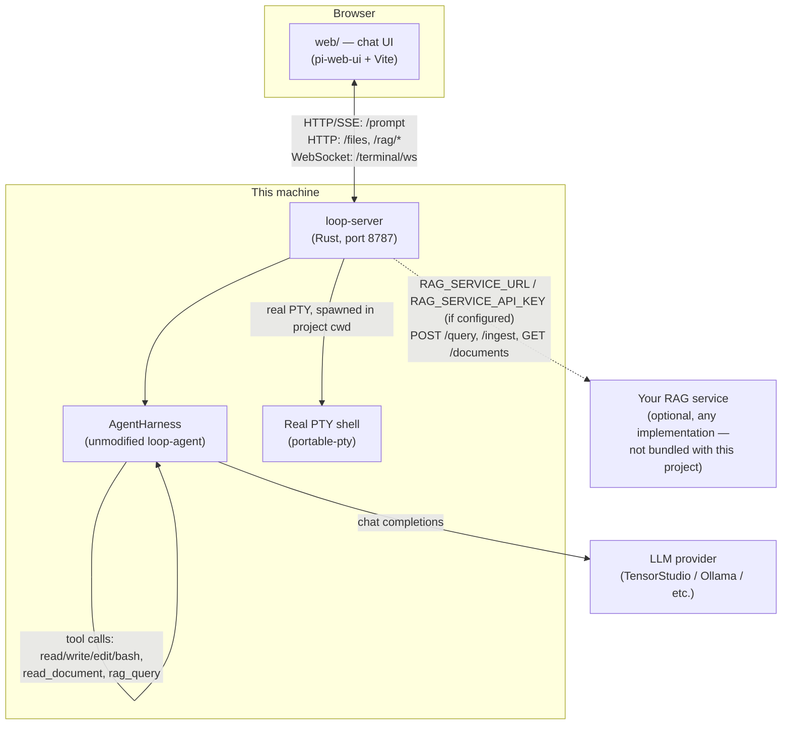
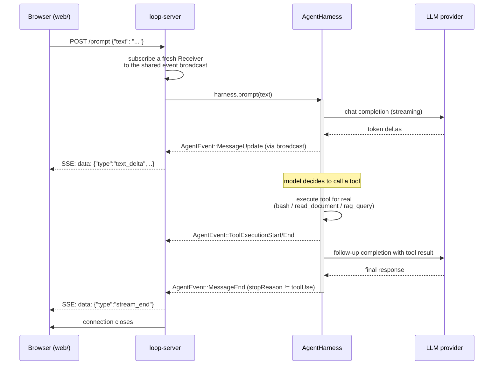

# The Loop Bridge

A browser-based chat UI for Loop's `AgentHarness` — the same stateful agent
the `loop` TUI uses, exposed instead over HTTP/SSE/WebSocket to a real web
frontend. Built on top of Loop without modifying it, and without even being
able to: every file under `loop-agent`, `loop-ai`, and `loop-app-core` lives
in the real upstream [`soketlabs/loop`](https://github.com/soketlabs/loop)
project, pulled in here as an ordinary Cargo git dependency (pinned to a
specific commit), not vendored, copied, or forked.

Everything described here lives in two sibling pieces in *this* repo —
[`bridge/`](bridge/README.md) and [`web/`](web/README.md) — that consume
the harness's existing public API from the outside, plus an optional
connection to any RAG (retrieval-augmented generation) service you provide.

## Repository layout

Three independently-runnable pieces, three trust/deploy boundaries:

| Repo/folder | What | Depends on the others via |
|---|---|---|
| [`soketlabs/loop`](https://github.com/soketlabs/loop) (upstream, not ours) | The agent itself — `AgentHarness`, tools, LLM API, the `loop` CLI | nothing here |
| [`bridge/`](bridge/README.md) (this repo) | HTTP/SSE/WebSocket server exposing the harness | a Cargo **git dependency** on `soketlabs/loop`, pinned to a commit |
| [`web/`](web/README.md) (this repo) | The actual browser chat UI | the bridge's HTTP API, at a configurable URL |

`soketlabs/loop` is a public repo — this dependency needs no credentials
and works for anyone who clones this repo, unlike an earlier version of
this project which depended on a private mirror we maintained ourselves.

This document is the system-level overview. Each piece also has its own
much more detailed README, including the specific bugs hit and fixed along
the way, live-verification notes, and code-level rationale:

- [`bridge/README.md`](bridge/README.md) — the bridge server itself, including the RAG interface contract and how it connects to the harness
- [`web/README.md`](web/README.md) — the chat frontend, including how it connects to the bridge
- [`soketlabs/loop`'s own README](https://github.com/soketlabs/loop) — the harness itself

## What this actually is

Two cooperating pieces in this repo, each independently replaceable, plus
an optional third-party service:

1. **`bridge/`** (Rust, package name `loop-server`) — boots a real
   `AgentHarness` the same way the TUI does, then translates its internal
   event stream into JSON pushed to a browser. No thinking of its own; a
   pure protocol bridge.
2. **`web/`** (TypeScript, Vite, `pi-web-ui`) — the actual chat interface a
   person uses. Talks to the bridge over HTTP/SSE, and to nothing else
   directly.
3. **A RAG service — not bundled, connected via config.** The bridge
   can talk to any RAG system that implements a small fixed interface
   (see `bridge/README.md` "Swapping in a RAG service"). No
   RAG service ships with this project, and none is required — without one
   configured, the RAG tool/commands just honestly report that rather than
   fabricating results.

## Architecture



Two independent network hops can leave your machine: `loop-server` → the
LLM provider (always, for chat), and `loop-server` → your RAG service (only
if you've configured one — dashed line above, entirely optional).
Everything else — the terminal, file browsing, the harness itself — runs
locally.

## How the bridge actually connects the UI to the harness

This is the core problem the whole `loop-server` crate exists to solve:
**`AgentHarness` is a Rust object with a Rust API — it has no idea what a
browser, HTTP, or JSON is.** The TUI (`loop-cli`) talks to it through
direct function calls in the same process. To let a browser talk to the
same harness, something has to sit in between and translate in both
directions — that's the bridge, and it's genuinely just that: a
translation layer with no intelligence of its own. It never decides
anything, never talks to the LLM directly, never runs a tool itself — it
only relays.

### One harness, shared by every request

`loop-server` boots exactly **one** `AgentHarness` at startup, using the
same `bootstrap()` function `loop-cli` calls — not a reimplementation, the
literal same code path. That one harness instance lives for the life of
the process and is shared by every browser request.

### The event bus in the middle

The harness doesn't return one big response — internally, it emits a
stream of `AgentEvent`s as it works (`MessageStart`, text/thinking deltas
as the model generates them, `ToolExecutionStart`/`End` as it runs
`bash`/`rag_query`/etc., `MessageEnd`, and so on). `loop-server` subscribes
to that stream **exactly once**, at startup, and re-broadcasts every event
onto an internal `tokio::sync::broadcast` channel.

That one extra hop matters: subscribing to the harness fresh on every
`/prompt` request was the first approach, and it leaked — `AgentHarness`'s
`subscribe()` has no way to unsubscribe, so every request would've added a
permanent listener that outlives the request forever. Routing everything
through one shared broadcast channel instead means each request's listener
is just a cheap `Receiver`, cleaned up automatically the moment its
response ends.

### One request, start to finish



Everything from `harness.prompt(text)` down happens entirely server-side,
inside one `/prompt` call — including a full tool-calling round trip
(model → tool call → real execution → model again), which can mean several
internal `MessageStart`/`MessageEnd` pairs inside one SSE stream. Only the
last one, whose `stopReason` isn't `toolUse`, is the real end of the turn;
the browser never sees the intermediate ones as separate turns.

### The other half of the bridge: reshaping the stream in the browser

Loop's event shape (`AgentEvent`) and what the chat UI library
(`pi-agent-core`) expects to receive from a normal LLM stream
(`AssistantMessageEvent`) are different protocols — Loop wraps `start`/
`done` inside `MessageStart`/`MessageEnd`, only forwarding the
delta-producing middle events as-is. `web/src/loop-stream.ts`'s
`createLoopStreamFn` is a custom `StreamFn` that reads the `/prompt` SSE
stream and re-synthesizes it into the shape `pi-agent-core` actually
expects, so the rest of the chat UI can render it exactly as if it were
talking to a real LLM API directly — it has no idea `loop-server` (or
Loop, or a bridge) exists at all. See `web/README.md` for the specific
regressions hit getting this translation exactly right.

### Terminal and Files: simpler, separate bridges

Chat needs a persistent, ordered event stream — SSE. Terminal needs
bidirectional byte-level I/O — a real WebSocket carrying a real PTY's raw
input/output (`portable-pty`), nothing translated, just relayed. Files
needs neither — plain, stateless HTTP GET per request. Three different
protocols because they're three genuinely different needs, not one
protocol stretched to fit everything.

## Features

### Chat
Real-time streaming responses over Server-Sent Events, backed by the real
`AgentHarness` — not a mock, not a scripted demo. Session state persists
server-side across restarts (`.loop-server-session-id`).

### Files
Browses the filesystem the `loop-server` process can read (by explicit
request, scoped to the whole filesystem — see "Security" below, not just
the project directory).

### Terminal
A real, interactive PTY-backed shell (`portable-pty`), streamed over a raw
WebSocket. The same level of access the model's own `bash` tool already
has — a human typing directly, not a new capability.

### Tool calling
The model has 6 real tools it can invoke on its own:

| Tool | What it does |
|---|---|
| `read`, `write`, `edit`, `bash` | Loop's standard 4 (unmodified, from `loop_app_core::runtime::build_tools`) |
| `read_document` | Reads a PDF or text file already on disk, real extraction via `pdf-extract` |
| `rag_query` | Queries the configured RAG service for context |

### RAG — two ways to use it
1. **Automatic**: the model calls `rag_query`/`read_document` on its own
   whenever it decides a question needs them.
2. **Manual, instant, no LLM turn**: four slash commands, typed directly or
   picked from the `+` button's dropdown menu:

   | Command | Does |
   |---|---|
   | `/rag-query <question>` | Semantic search + generated answer |
   | `/rag-add <path>` | Ingests a file from disk into the RAG service |
   | `/rag-list` | Lists every ingested document |
   | `/rag-get <doc_id>` | Fetches one document's **exact** original text (not a search result) |

   Results from these four render visually distinct from normal chat
   replies — a purple accent border, tinted background, and an uppercase
   label (e.g. `RAG-QUERY`) — so it's obvious at a glance that an answer
   came from a direct tool call, not the model's own words.

## Getting started

```bash
# 1. Build the bridge
cargo build -p loop-server

# 2. Configure it (copy and edit)
cp .env.example .env
# at minimum: point LOOP_SERVER_PROVIDER/LOOP_SERVER_MODEL at something
# real (a hosted API, or a local Ollama — see .env.example for both), and
# optionally RAG_SERVICE_URL/RAG_SERVICE_API_KEY for RAG

# 3. Run it
./target/debug/loop-server
# → registers 6 tools, boots the harness, listens on :8787

# 4. Run the frontend, separately
cd web && npm install && npm run dev
# → opens on :5173
```

Or both together: `./scripts/dev.sh` from the repo root.

## Configuration

All of it lives in `.env` at the repo root (see `.env.example` for the full
annotated reference). The pieces most relevant to this bridge:

```bash
# Which model the harness talks to
LOOP_SERVER_PROVIDER=tensorstudio-litellm   # or "ollama" for a free local model
LOOP_SERVER_MODEL=qwen3-8-27b

# RAG service (optional — see "The RAG system" below; leave unset for none)
# RAG_SERVICE_URL=https://your-rag-service.example.com
# RAG_SERVICE_API_KEY=<your-key>

# Networking
LOOP_SERVER_PORT=8787
LOOP_SERVER_CORS_ORIGIN=http://localhost:5173
```

## API reference

| Method | Path | Purpose |
|---|---|---|
| `GET` | `/health` | `{session_id, status}` |
| `POST` | `/prompt` | `{text}` → SSE stream of chat events |
| `GET` | `/files` | Directory listing |
| `GET` | `/files/content` | File contents (text preview) |
| `GET` | `/terminal/ws` | WebSocket upgrade → real PTY shell |
| `POST` | `/rag/query` | Direct RAG query, no LLM turn (`/rag-query`) |
| `POST` | `/rag/ingest` | Direct RAG ingest, no LLM turn (`/rag-add`) |
| `GET` | `/rag/documents` | List ingested documents (`/rag-list`) |
| `GET` | `/rag/documents/:id` | Exact document text (`/rag-get`) |

Full request/response shapes, status codes, and the reasoning behind each
are in [`bridge/README.md`](bridge/README.md#api).

## The RAG system

**No RAG service is bundled with this project.** `loop-server` can connect
to any RAG (retrieval-augmented generation) service you already have or
build — it's opt-in, configured entirely through two env vars, and
everything else here works fine with it left unset (the RAG tool/commands
just honestly say "not configured" instead of fabricating results).

An earlier version of this project bundled a real, working test
implementation — a small Cloudflare Worker (real embeddings, a real vector
database, real generation, deployed serverlessly) — to have something to
develop and verify against. It's since been removed: the goal is to
connect whatever RAG system you actually have, not to default to one
particular implementation.

### The interface contract

`loop-server` only knows about one small, fixed shape — nothing about any
specific RAG provider is hardcoded anywhere in this repo's Rust or
TypeScript:

| | Request | Response |
|---|---|---|
| `POST {RAG_SERVICE_URL}/query` | `{"query": "..."}` | any JSON (`{"answer", "matches"}` renders nicest) |
| `POST {RAG_SERVICE_URL}/ingest` | `{"text": "...", "id": "..."}` | any JSON (`{"doc_id", "chunks_stored"}` renders nicest) |

Auth: `Authorization: Bearer {RAG_SERVICE_API_KEY}` sent if that env var is
set.

**To connect a RAG system**: set `RAG_SERVICE_URL` (and `RAG_SERVICE_API_KEY`
if it needs auth) in `.env`. If it already speaks this shape, that's the
entire integration — zero code changes. If it doesn't (likely — this shape
is a convention invented for this project, not an industry standard), the
fix is a thin translating adapter in front of it, not editing this code.

`/rag/documents` and `/rag/documents/:id` (powering `/rag-list`/`/rag-get`)
are **not** part of this contract — most vector databases have no native
"list everything" or "exact fetch by ID" API (pure similarity search
only), so a RAG service needs its own separate mechanism to support these
two at all. Many won't; those two commands simply won't work until it does
(or until an adapter fakes that layer too).
